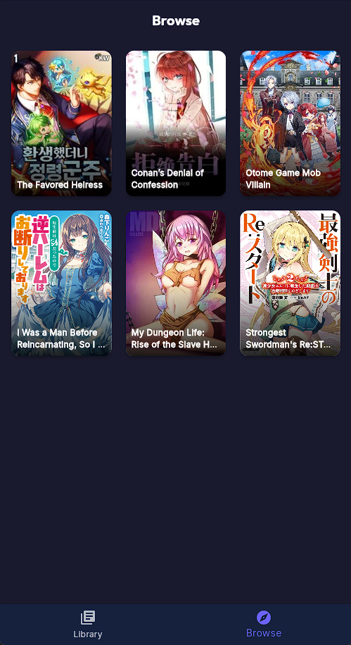
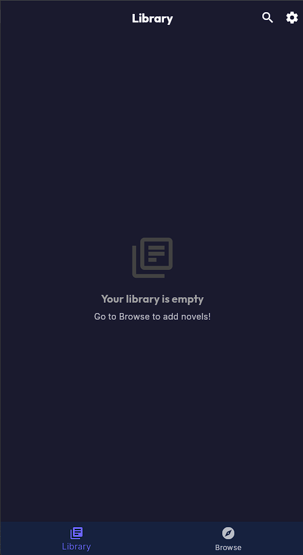
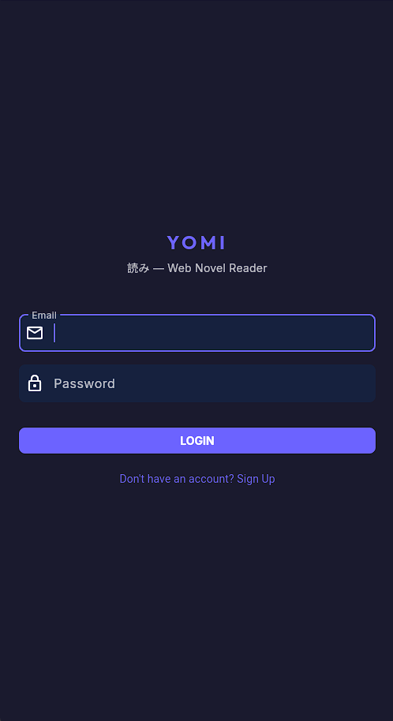

# Yomi (読み) 📖
A clean, ad-free web novel reader with a Tachiyomi-inspired UI, built using Flutter Web and Firebase.

## 🌍 Live Demo
**[Launch Yomi Web App](https://yomi-9d453.web.app)**

---

## 📸 Screenshots

<div align="center">
  
  
  
  
</div>

---

## ✨ Features
- **Tachiyomi-Inspired UI**: Beautiful dark theme with grid layouts for easy browsing.
- **Cross-Device Sync**: Your reading progress is automatically saved to the cloud and synced across devices.
- **Distraction-Free Reader**: Adjustable font sizes and a seamless vertical scrolling experience.
- **Huge Automated Library**: Seeded with hundreds of chapters scraped via custom Node.js automation scripts.
- **Secure Authentication**: Email/Password login powered by Firebase Auth.

---

## 🛠️ Tech Stack
* **Frontend**: Flutter (Dart) compiled for the Web.
* **Backend Framework**: Firebase Services.
* **Database**: Cloud Firestore (NoSQL).
* **Hosting**: Firebase Hosting (CDN cached).
* **Automation**: Node.js + Cheerio (for web scraping novel contents).

---

## 🚀 Getting Started Locally

1. **Clone the repository**:
   ```bash
   git clone https://github.com/your-username/yomi.git
   cd yomi/yomi_app
   ```
2. **Install Flutter Dependencies**:
   ```bash
   flutter pub get
   ```
3. **Run the App Locally**:
   ```bash
   flutter run -d chrome
   ```

*(Note: The Firebase configuration (`firebase_options.dart`) is pre-linked to the cloud infrastructure!)*
