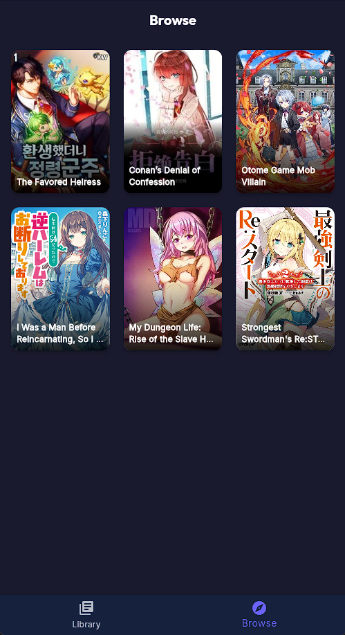
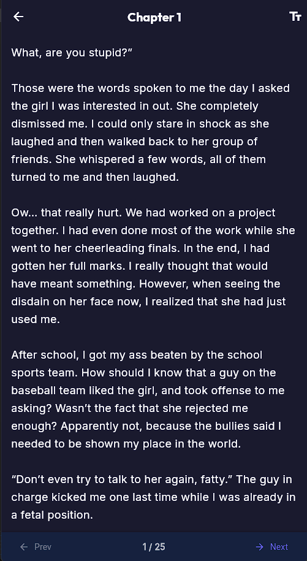
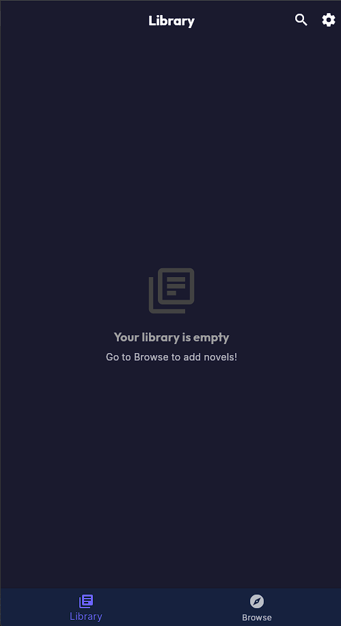
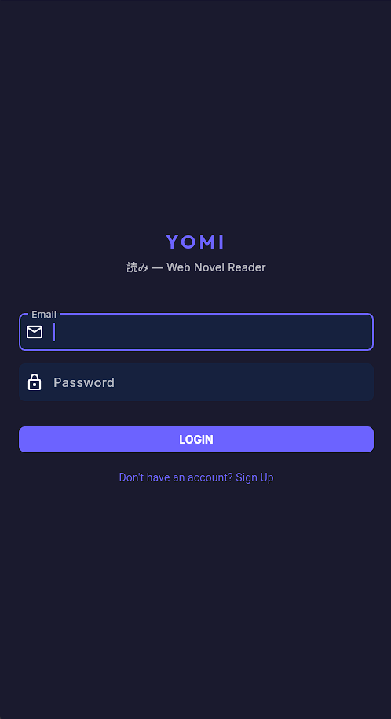

# Yomi (読み) 📖
A clean, ad-free web novel reader with a Tachiyomi-inspired UI, built using Flutter and a local XAMPP (MySQL/PHP) backend.

---

## 📸 Screenshots

<div align="center">
  
  
  
  
</div>

---

## ✨ Features
- **Tachiyomi-Inspired UI**: Beautiful dark theme with grid layouts for easy browsing.
- **Local & Production Database Sync**: Your reading progress and library are synchronized seamlessly.
- **Distraction-Free Reader**: Adjustable font sizes and a seamless vertical scrolling experience.
- **Secure Authentication & Logout**: Local Login/Signup system powered by PHP and password hashing, complete with a secure session logout function accessible from the Library screen settings.

---

## 🛠️ Tech Stack
* **Frontend**: Flutter (Dart) — Cross-platform support for Web, Windows, and Mobile.
* **Backend**: PHP REST API (served via Apache/XAMPP locally or live host in production).
* **Database**: MySQL (local `yomi_db` or live InfinityFree production database).
* **Storage**: Local/Remote filesystem for novel cover images.
* **Architecture**: Environment-agnostic asset and API routing using relative paths (`./api.php` and `./covers/`) for hassle-free deployments.

---

## 🚀 CI/CD & Production Deployment

The project is configured with a fully automated CI/CD pipeline using **GitHub Actions**:

- **Continuous Deployment**: Push-to-deploy workflow configured in [.github/workflows/firebase-hosting-merge.yml](file:///.github/workflows/firebase-hosting-merge.yml) (triggered automatically on push to the `main` branch).
- **Build Process**: The runner automatically checks out the repository, installs the Flutter SDK, fetches dependencies, and compiles a production-ready Flutter Web build.
- **FTP Deployment**: The compiled static web files are automatically synced and deployed to **InfinityFree** (`ftpupload.net`) under the `htdocs/` folder using `SamKirkland/FTP-Deploy-Action`.
- **Live Endpoint**: The production app communicates with the live database hosted on `sql313.infinityfree.com` and resolves requests relatively on the hosting server.

---

## 💻 Getting Started Locally

### 1. Prerequisites
- **XAMPP** installed (Apache and MySQL must be running).
- **Flutter SDK** installed.

### 2. Backend Setup (Local XAMPP)
1. Create a folder: `C:\xampp\htdocs\yomi_api\`.
2. Copy the API files (`yomi_api/api.php`, `yomi_api/covers/`, etc.) into that folder.
3. Open **phpMyAdmin**, create a database named `yomi_db`, and import the [yomi_db.sql](file:///db/yomi_db.sql) file.
4. Ensure the database connection parameters in `api.php` are set to your local credentials:
   ```php
   $DB_HOST = 'localhost';
   $DB_USER = 'root';
   $DB_PASS = '';
   $DB_NAME = 'yomi_db';
   ```

### 3. Frontend Setup (Local Development)
1. Navigate to the app folder:
   ```bash
   cd yomi_app
   ```
2. Install dependencies:
   ```bash
   flutter pub get
   ```
3. **Configure API Endpoints for Local Dev**:
   Because the frontend uses relative paths (`./api.php` and `./covers/`) for production deployment, running the app locally via the Flutter development server (which runs on a separate port, e.g. `localhost:5000`) will fail to resolve the relative paths to your local XAMPP server (running on `localhost:80` / `localhost/yomi_api/`).
   
   To develop locally, make the following quick adjustments:
   - In [api_service.dart](file:///yomi_app/lib/services/api_service.dart), change the `baseUrl` line:
     ```dart
     // For local Web/Desktop:
     static const String baseUrl = 'http://localhost/yomi_api/api.php';
     // For Android Emulator:
     // static const String baseUrl = 'http://10.0.2.2/yomi_api/api.php';
     ```
   - In [novel.dart](file:///yomi_app/lib/models/novel.dart), update the `coverImageUrl` getter to point to your local covers directory:
     ```dart
     String get coverImageUrl =>
         coverImage != null && coverImage!.isNotEmpty
             ? 'http://localhost/yomi_api/covers/$coverImage'
             : '';
     ```

4. Run the App:
   ```bash
   flutter run -d chrome
   ```
